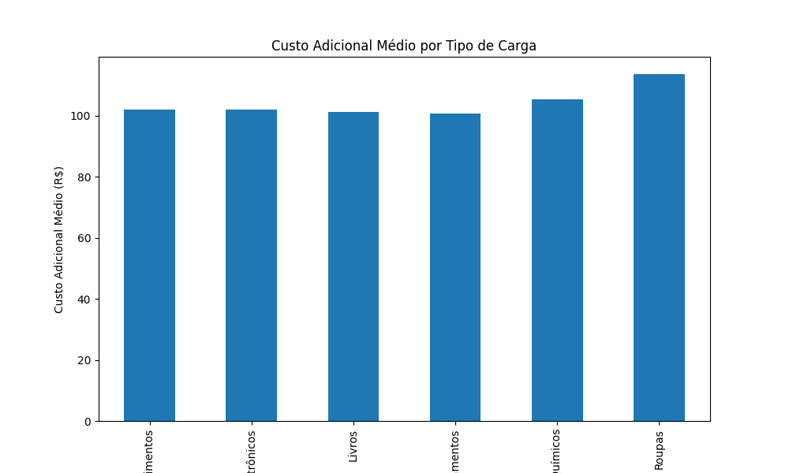

# Projeto de Análise de Fretes

Este projeto foi criado para analisar dados de fretes entre várias cidades. A análise inclui informações sobre a origem, destino, tipo de carga, valor do frete, datas de contratação e entrega, tempo de entrega, forma de pagamento, status da entrega, custo adicional e observações.

## Dados

Os dados foram gerados usando um script Python para simular operações de frete entre diversas cidades brasileiras. O arquivo `amostra_fretes.csv` gerado após execução do código contém as seguintes colunas:

- Origem
- Destino
- Tipo de Carga
- Valor do Frete (R$)
- Data de Contratação
- Data de Entrega
- Tempo de Entrega (dias)
- Forma de Pagamento
- Status da Entrega
- Custo Adicional (R$)
- Observações

## Análise de Desempenho

### Padrões de Atrasos

#### Número de Atrasos por Cidade de Origem


#### Número de Atrasos por Tipo de Carga


### Análise de Custos Adicionais

#### Custo Adicional Médio por Cidade de Origem


#### Custo Adicional Médio por Tipo de Carga


## Recomendações

As recomendações para melhorar o desempenho dos fretes incluem:
1. Focar em melhorar as operações logísticas nas cidades com maior número de atrasos.
2. Implementar processos específicos para tipos de carga que frequentemente sofrem atrasos.
3. Analisar os fatores que contribuem para altos custos adicionais em determinadas cidades e tipos de carga e buscar soluções para minimizá-los.

## Visualizações

### Número de Fretes por Cidade de Origem


### Mapa de Calor de Fretes entre Cidades


### Número de Fretes ao Longo do Tempo


## Análise de Dados com Jupyter Notebook

O notebook Jupyter `analise_fretes.ipynb` inclui análises detalhadas dos dados de fretes, respondendo a perguntas de negócios específicas e gerando visualizações úteis.

### Como Usar o Notebook

1. Certifique-se de ter Jupyter Notebook instalado:
   ```sh
   pip install notebook pandas matplotlib seaborn
   ```
2. Navegue até o diretório do projeto e inicie o Jupyter Notebook:
   ```sh
   jupyter notebook
   ```
3. Abra o arquivo `analise_fretes.ipynb` e execute as células para gerar as análises e visualizações.

## Documentação Técnica

Este script foi desenvolvido para gerar dados simulados de fretes entre várias cidades brasileiras, realizar análises de desempenho e gerar visualizações para auxiliar na tomada de decisões.

### Estrutura do Script

1. **Importação das Bibliotecas**:
   - `pandas`, `matplotlib.pyplot`, `seaborn`, `random`, `datetime`, `timedelta`: Bibliotecas utilizadas para manipulação de dados, visualização e geração de valores aleatórios.

2. **Função `gerar_dados_fretes`**:
   - Gera um DataFrame com dados simulados de fretes.
   - Utiliza listas de cidades, tipos de carga, formas de pagamento e status de entrega para gerar dados aleatórios.
   - Gera colunas como origem, destino, tipo de carga, valor do frete, datas, tempo de entrega, forma de pagamento, status da entrega, custo adicional e observações.

3. **Geração e Salvamento dos Dados**:
   - Chama a função `gerar_dados_fretes` para gerar 1000 linhas de dados.
   - Salva o DataFrame gerado em um arquivo CSV chamado `amostra_fretes.csv`.

4. **Análise de Desempenho dos Fretes**:
   - **Identificação de Padrões de Atrasos**:
     - Filtra os dados para encontrar entregas com status "Atraso".
     - Conta o número de atrasos por cidade de origem e tipo de carga.
   - **Análise de Custos Adicionais**:
     - Calcula a média de custos adicionais por cidade de origem e por tipo de carga.

5. **Visualizações**:
   - Gera gráficos para visualizar os dados e as análises, como gráficos de barras, mapas de calor e linhas do tempo.
   - Salva os gráficos gerados como arquivos de imagem.

6. **Recomendações**:
   - Gera um arquivo de texto com recomendações para melhorar o desempenho dos fretes com base nas análises realizadas.

## Como Usar

1. Clone este repositório:
   ```sh
   git clone https://github.com/engdalevedove/CargasETransportes
   ```
2. Navegue até o diretório do projeto:
   ```sh
   cd CargasETransportes
   ```
3. Execute o script para gerar as visualizações:
   ```sh
   python gerar_visualizacoes.py
   ```
4. Abra o arquivo `amostra_fretes.csv` no seu software de análise de dados preferido (por exemplo, Excel, Power BI, Python).

## Contribuição

Contribuições são bem-vindas! Sinta-se à vontade para abrir uma issue ou enviar um pull request.

## Licença

Este projeto está licenciado sob a Licença MIT.